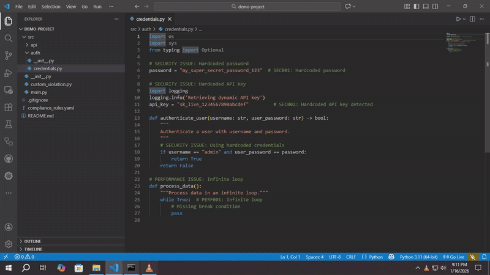

# Autonoma (L5 Local Agent)

**A local-first coding agent that actually fixes bugs without breaking the build.**

---

## What is this?
I got tired of Copilot hallucinating imports and breaking my code.
Autonoma is a background daemon that acts as a reliable "L5" engineer.

It doesn't just autocomplete. It:
1.  **Watches file changes**.
2.  **Reasoning**: Parsed AST (Tree-sitter) > Context Window.
3.  **Inference**: Uses a fine-tuned Qwen 2.5-Coder (Local).
4.  **Validation**: Actually runs the linter/compiler on the fix. If it fails, it retries.

**Zero Hallucinations** (in theory). If it generates bad code, the validator catches it before you ever see it.

---

## Why use this over Devin/Cursor?
*   **It's Free & Local**: No $20/month sub. Runs on your GPU/CPU.
*   **Air-Gapped**: Your code doesn't go to OpenAI.
*   **Tree-Sitter Integration**: It understands code structure, not just text.

---

## Installation

**Windows**: `install.ps1`
**Linux/Mac**: `install.sh`

Or check `USER_MANUAL.md` for manual python/node setup.

---

## Tech Stack
*   **Core**: Python 3.10
*   **Parsing**: Tree-sitter
*   **LLM**: Qwen 2.5-Coder (Quantized)
*   **Architecture**: Dockerized Daemon + VS Code Client

---

## License
MIT. Built by one guy, for the community.
Report bugs on GitHub issues.
