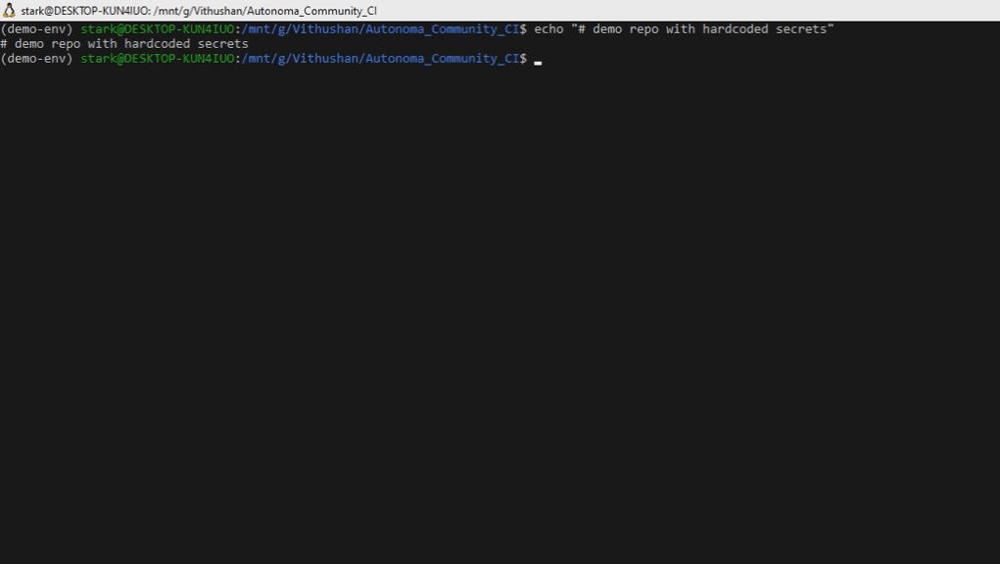

# Autonoma


**Deterministic secret remediation for Python.**

Autonoma is a deterministic security scanner that detects and safely fixes hardcoded secrets in Python codebases.

Unlike traditional secret scanners, Autonoma doesn't just report problems — it automatically replaces secrets with environment variable references when the fix can be proven safe.

If safety cannot be guaranteed, it refuses the change.




---

## Install

The open-source package is published to PyPI as `autonoma-cli`.

```bash
pip install autonoma-cli
```

Once installed, use the `autonoma` command:

```bash
autonoma --version
autonoma --help
```

## Quick Example

Scan a project:

```bash
autonoma analyze ./your-project
```

Scan and apply safe fixes:

```bash
autonoma analyze ./your-project --auto-fix
```

---

## Example

### Before

```python
# settings.py

DATABASES = {
    "default": {
        "ENGINE": "django.db.backends.postgresql",
        "NAME": "prod_db",
        "USER": "admin",
        "PASSWORD": "Pr0d@ccess2024!",  # SEC001
        "HOST": "db.internal.company.com",
    }
}

SENDGRID_API_KEY = "SG.live-abc123xyz987_realkey"  # SEC002
```

### After

```python
# settings.py

import os

DATABASES = {
    "default": {
        "ENGINE": "django.db.backends.postgresql",
        "NAME": "prod_db",
        "USER": "admin",
        "PASSWORD": os.environ["PASSWORD"],
        "HOST": "db.internal.company.com",
    }
}

SENDGRID_API_KEY = os.environ["SENDGRID_API_KEY"]
```

### Preview Fixes Safely

Preview fixes safely before applying them to guarantee deterministic outputs:

```diff
$ autonoma analyze demo-project --diff

- SENDGRID_API_KEY = "SG.live-abc123xyz987_realkey"
+ SENDGRID_API_KEY = os.environ["SENDGRID_API_KEY"]
```

### Example CLI Output

```
$ autonoma analyze demo-project --auto-fix

Scanning 10 files...

SEC001  settings.py:8
Hardcoded password detected
Status: FIXED

SEC002  config.py:3
Hardcoded API key detected
Status: FIXED

SEC002  utils.py:14
Ambiguous secret pattern
Status: REFUSED

--------------------------------
Files scanned: 10
Issues detected: 3
Fixed: 2
Refused: 1
```

---

## Commands

```bash
autonoma analyze PATH
autonoma analyze PATH --auto-fix
autonoma analyze PATH --diff
autonoma analyze PATH --json
autonoma analyze PATH --ci
autonoma history-scan PATH
autonoma --version
```

---

## CLI Features

Autonoma supports:

- `--auto-fix` — apply deterministic safe fixes
- `--diff` — preview proposed fixes as unified diffs
- `--json` — emit machine-readable output for automation
- `--ci` — use CI-oriented exit codes
- `--quiet` — minimize console output for pipelines
- `--threads` — parallelize scanning on larger repositories
- `.autonomaignore` — exclude noisy paths
- `history-scan` — detect secrets that still exist in Git history

---

## What Autonoma Detects

| Code       | Description                                        |
| ---------- | -------------------------------------------------- |
| **SEC001** | Hardcoded passwords                                |
| **SEC002** | Hardcoded API keys                                 |
| **SEC003** | High-risk SQL string construction                  |
| **SEC004** | Python SSTI patterns                               |
| **SEC005** | Insecure deserialization (`pickle`, unsafe `yaml`) |

Auto-fix support:

| Code              | Behavior             |
| ----------------- | -------------------- |
| **SEC001**        | Auto-fixed when safe |
| **SEC002**        | Auto-fixed when safe |
| **SEC003–SEC005** | Detection only       |

Autonoma deliberately avoids automatic rewrites for logic-level vulnerabilities.

---

## Safety Model

Autonoma only applies a fix when all three conditions are satisfied:

1. The transformation is structurally safe
2. The environment variable contract can be established
3. The modification introduces no ambiguity

Every finding produces one of four outcomes:

| Status      | Meaning                                        |
| ----------- | ---------------------------------------------- |
| **FIXED**   | Deterministic fix applied                      |
| **REFUSED** | Change declined to prevent unsafe modification |
| **SKIPPED** | Code already compliant                         |
| **FAILED**  | Tool error                                     |

---

## Refusal Examples

Refusal is intentional.
A wrong automated fix is worse than no fix.

### No Environment Contract

```python
API_KEY = "sk-live-abc123"
```

Refused because the project has no `.env` or dotenv dependency.

### Ambiguous Variable Name

```python
x = "sk-live-abc123"
```

Autonoma cannot safely infer an environment variable name.

### Already Compliant

```python
API_KEY = os.getenv("API_KEY", "sk-live-abc123")
```

Environment lookup already exists.

### Ambiguous Secret Construction

```python
token = "Bearer " + "sk-live-abc123"
```

Literal cannot be safely isolated.

---

## Git History Scanning

Autonoma can also detect secrets that were committed in the past and later removed from the working tree.

```bash
autonoma history-scan .
```

This helps identify secrets that still exist in Git history and may remain accessible through old commits, forks, mirrors, or cloned repositories.

---

## Why Autonoma Exists

Most security scanners stop at detection.
Developers still need to manually remove secrets from code.

Autonoma focuses on deterministic remediation — automatically fixing the subset of issues that can be proven safe.

If safety cannot be guaranteed, it refuses the change instead of guessing.

---

## What Autonoma Deliberately Does NOT Do

Autonoma intentionally avoids features that cannot be made deterministic.

It does not perform:

- full taint analysis
- full data flow analysis
- automatic SQL injection rewriting
- automatic SSTI remediation
- LLM-generated patches

Only transformations that can be proven safe are applied automatically.
Everything else is flagged for human review.

---

## CI Example

Autonoma can run directly in CI pipelines.

```yaml
- name: Install Autonoma
  run: pip install autonoma-cli

- name: Scan repository
  run: autonoma analyze . --ci
```

Exit codes:

- `0` — no issues found
- `1` — issues found, but none are automatically fixable
- `2` — fixable issues found
- `3` — internal error

---

## Architecture

Autonoma is a local-first security remediation tool.

Key characteristics:

- Python 3.10+
- AST-based secret detection and remediation
- deterministic code transformations
- no telemetry
- no cloud dependency
- no LLM usage

All analysis runs entirely on the local machine.

---

## Validation

Autonoma has been tested across synthetic repositories, seeded secret datasets and real-world open-source Python projects containing exposed credentials.

Current validation results:

- 0 crashes across tested repositories
- 0 syntax breakage after auto-fix
- deterministic output across repeated runs
- idempotent fixes on rerun
- dry-run and diff preview do not modify files

Performance benchmarks:

| Repository Size | Files | LOC    | Runtime |
|-----------------|------:|-------:|--------:|
| Small           | 5     | 503    | 0.16s   |
| Medium          | 34    | 3,029  | 0.24s   |
| Large           | 77    | 10,025 | 0.27s   |
| Very Large      | 351   | 30,063 | 0.55s   |

Unsafe patterns are refused instead of rewritten.

---

## Enterprise

Autonoma Community Edition focuses on deterministic local remediation for Python projects.

Planned enterprise capabilities include:

- policy enforcement
- CI/CD integration
- audit logs
- approval workflows
- multi-repository orchestration

Enterprise capabilities are under development.

If your team is interested in early evaluation or pilot deployments,
feel free to reach out.
---

## Contributing

Bug reports and edge cases are extremely valuable.

If Autonoma:

- fixes something incorrectly
- refuses a safe pattern
- misses a detectable secret

please open an issue with the code sample.

Pull requests are welcome.

---

## License

MIT License
